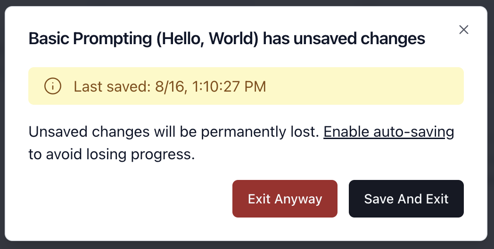

Langflow currently supports both manual and auto-saving functionality.

## Auto-saving {#auto-saving}

When Langflow is in Auto-saving mode, all changes are saved automatically. Auto-save progress is indicated in the left side of the top bar: when a flow is being saved, a Loading icon indicates that the flow is being saved in the database.


If you try to exit the flow page before auto-save completes, a dialog will appear to confirm you want to exit before the flow has saved.


When the flow has successfully saved, you can click the 'Exit' button.


## Manual Saving {#manual-saving}

When auto-saving is disabled, you need to manually save your flow when making changes. You can still run the flow without saving, for testing purposes.

If you make any changes and Langflow detects that the saved flow is different from the current flow, a Save button will be enabled and the last time saved will appear at the left side of the topbar. To save the flow, click the Save button, or hit Ctrl+S or Command+S.


If you try to exit after making changes and not saving, a confirmation dialog will appear. You can choose to exit anyway or save and exit.



## Disable Auto Saving {#environment}

In Langflow, all changes made in the flows are saved automatically. However, you may prefer to disable this functionality, if you want a quick way to prototype and test changes before they are actually saved to the database.

If you wish to disable this functionality, you can run Langflow with an environment variable to tell Langflow to use manual saving.

```shell
langflow --no-auto-saving
# or
python -m langflow --no-auto-saving
```

If you installed the local version of Langflow, you can set an environment variable and load it automatically by inserting this line into the ".env" file inside the directory.

```env
LANGFLOW_AUTO_SAVING=false
```
