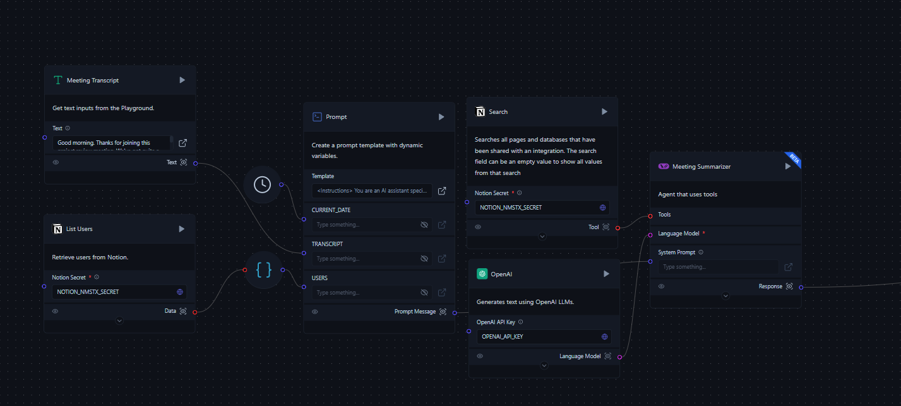
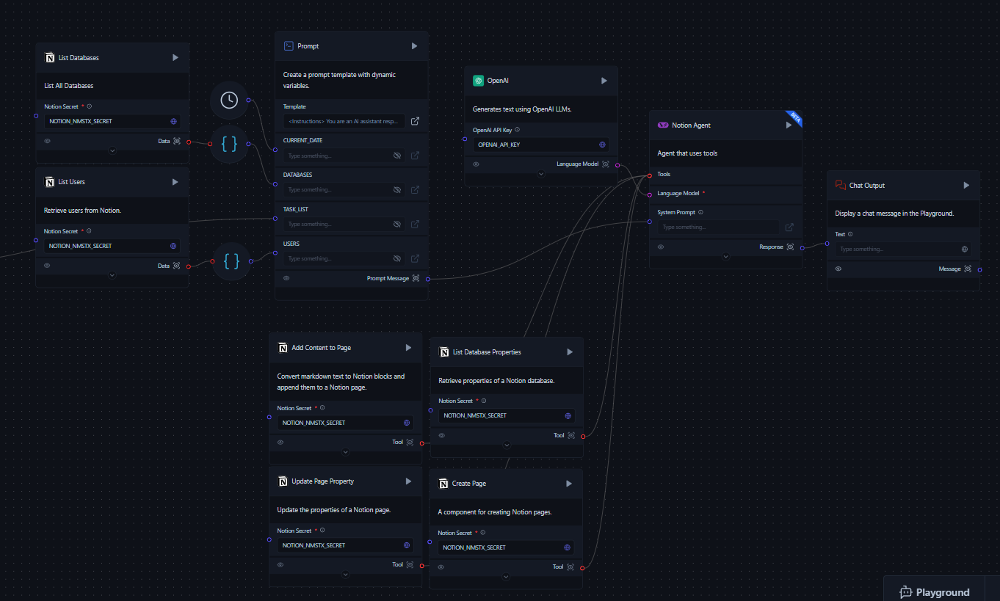

The Notion Agent for Meeting Notes is an AI-powered tool that automatically processes meeting transcripts and updates your Notion workspace. It identifies tasks, action items, and key points from your meetings, then creates new tasks or updates existing ones in Notion without manual input.

## Prerequisites
---

- [Notion App](/integrations/notion/setup)
- [Notion API key](https://www.notion.so/my-integrations)
- [OpenAI API key](https://platform.openai.com/account/api-keys)

:::warning

Before using this flow, ensure you have obtained the necessary API keys from Notion and OpenAI. These keys are essential for the flow to function properly. Keep them secure and do not share them publicly.

:::

## Components

---

### Meeting Transcript (Text Input) #[meeting-transcript]

This component allows users to input the meeting transcript directly into the flow.

### List Users (Notion Component) #[list-users]

- **Purpose**: Retrieves a list of users from the Notion workspace.
- **Input**: Notion Secret (API key)
- **Output**: List of user data

### List Databases (Notion Component) #[list-databases]

- **Purpose**: Searches and lists all databases in the Notion workspace.
- **Input**:
  - Notion Secret (API key)
  - Query (optional)
  - Filter Type (default: database)
  - Sort Direction
- **Output**: List of database data

### Prompt

This component creates a dynamic prompt template using the following inputs:
- Meeting Transcript
- List of Users
- List of Databases
- Current Date

### Meeting Summarizer (Tool Calling Agent)

- **Purpose**: Analyzes the meeting transcript and identifies tasks and action items.
- **Inputs**:
  - System Prompt (from the Prompt component)
  - Language Model (OpenAI)
  - Tools:
    - Notion Search
    - List Database Properties
    - Create Page
    - Update Page Property
    - Add Content to Page

### Notion Agent (Tool Calling Agent)

- **Purpose**: Executes actions in Notion based on the meeting summary.
- **Inputs**:
  - System Prompt (from the second Prompt component)
  - Language Model (OpenAI)
  - Tools:
    - List Database Properties
    - Create Page
    - Update Page Property
    - Add Content to Page

### Notion Components (Tools)

#### List Database Properties

- **Purpose**: Retrieves the properties of a specified Notion database.
- **Input**:
  - Database ID
  - Notion Secret (API key)

#### Create Page

- **Purpose**: Creates a new page in a Notion database.
- **Inputs**:
  - Database ID
  - Notion Secret (API key)
  - Properties (JSON)

#### Update Page Property

- **Purpose**: Updates the properties of an existing Notion page.
- **Inputs**:
  - Page ID
  - Notion Secret (API key)
  - Properties to update

#### Add Content to Page

- **Purpose**: Converts markdown text to Notion blocks and appends them to a specified Notion page.
- **Inputs**:
  - Page/Block ID
  - Notion Secret (API key)
  - Markdown text

### Chat Output

Displays the final output of the Notion Agent in the Playground.

## Flow Process

---

1. The user inputs a meeting transcript.
2. The flow retrieves the list of Notion users and databases.
3. A prompt is generated using the transcript, user list, database list, and current date.
4. The Meeting Summarizer analyzes the transcript and identifies tasks and action items.
5. The Notion Agent uses the meeting summary to:
   - Create new pages for new tasks
   - Update existing pages for existing tasks
   - Add content to pages with meeting notes
6. The Chat Output displays a summary of actions taken in Notion.

## Usage

---

To use the Notion Agent for Meeting Notes:

1. Ensure you have the necessary API keys for Notion and OpenAI.
2. Input these API keys in the respective components.
3. Paste your meeting transcript into the Meeting Transcript component.
4. Run the flow.
5. Review the output in the Chat Output component, which will summarize the actions taken in your Notion workspace.

:::info

Pro Tip: For optimal results, use detailed meeting transcripts. The quality of the output depends on the comprehensiveness of the input provided.

:::

## Customization

---

:::note

The flow can be customized to match your team's specific needs. Feel free to adjust the prompts and settings as necessary to align with your workflow.

:::